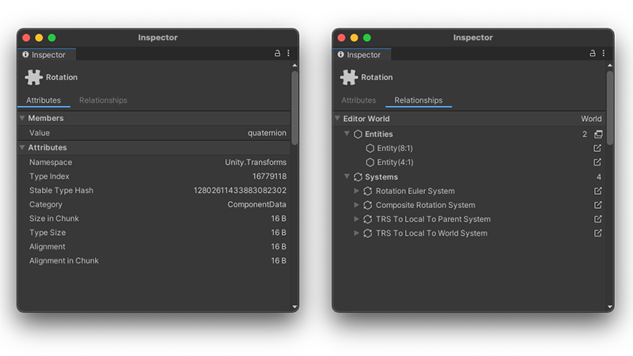

# Component Inspector reference

When you select a Component, the [Inspector](https://docs.unity3d.com/Manual/UsingTheInspector.html) displays its information in two tabs:

* **Attributes:** Displays information about the Component’s C# type, such as its namespace, member fields, and allocated chunk size.
* **Relationships**: Displays all Entities that have the selected Component, and all Systems that query the Component, per World.

 _Component Inspector, Attributes (Left), Relationships (Right)_

Click on the icon to the right of a System or Entity name (), to change the selection to that System or Entity. Unity also opens the respective [System Inspector](editor-system-inspector.md) or [Entity Inspector](editor-entity-inspector.md) where possible.

## Additional resources

* [Components user manual](ecs_components.md)
* [Components window reference](editor-components-window.md)
* [Entity Inspector reference](editor-entity-inspector.md)
* [System Inspector reference](editor-system-inspector.md)
* [Query window reference](editor-query-window.md)