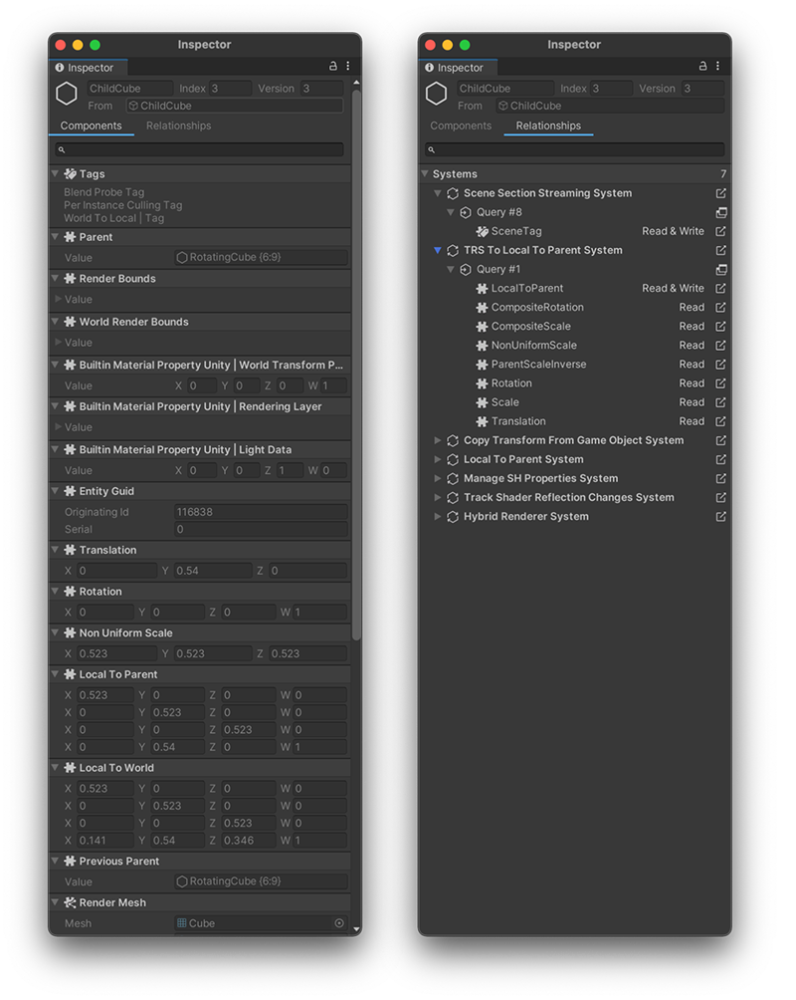

# Entity Inspector reference

When you select an Entity, the [Inspector](https://docs.unity3d.com/Manual/UsingTheInspector.html) displays its information in two tabs:

* **Components:** Displays all the [Components](ecs_components.md) on an Entity, similar to displaying the MonoBehaviours on a GameObject. 
* **Relationships:** Displays all the [Systems](ecs_systems.md) that touch the selected Entity. This tab displays information only if the Entity has one or more Components that satisfy a [system query](ecs_entity_query.md).

 _Entity Inspector - Components tab (Left), Relationships tab (Right)_

## Components tab

The fields in the Components tab have two states:

* In Edit mode, they're read-only. 
* In Play mode, you can edit them for debugging purposes. When you exit Play mode, the GameObject conversion process overrides any changes you made.

## Relationships tab

The Relationships tab displays the System queries that match the selected Entity. This view also displays the System’s access rights to the Components (**Read** or **Read & Write**). 

Click on the icon to the right of a System or Component name (), to change the selection to that System or Component. Unity also opens the respective [System Inspector](editor-system-inspector.md) or [Component Inspector](editor-component-inspector.md) where possible.

To see a list of all the Entities that match a query, click on the icon () next to a query. Unity opens the [Query window](editor-query-window.md).

## Additional resources

* [Entities user manual](ecs_entities.md)
* [DOTS Hierarchy window reference](editor-hierarchy-window.md)
* [System Inspector reference](editor-system-inspector.md)
* [Component Inspector reference](editor-component-inspector.md)
* [Query window reference](editor-query-window.md)