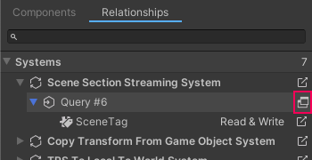
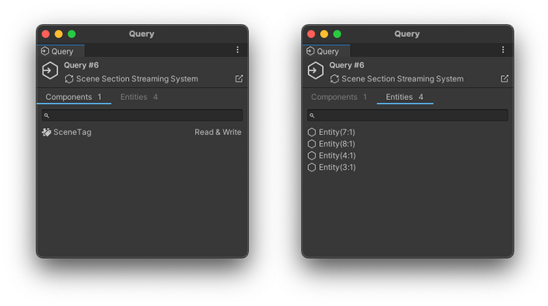

# Query window reference

The Query window displays detailed information about a selected [query](ecs_entity_query.md).

To open the Query window, open the Relationship tab in an [Entity, System, or Component Inspector](editor-inspectors.md), and select the button  next to a query. Unity then opens a window with information about the query's related Components and Entities.

 _Query window button highlighted in the Relationships tab of an Entity Inspector._

The Query window has two tabs: 

* **Components:** Displays a list of Components that the selected query searches for. It also displays the access rights to the Component (**Read** or **Read & Write**). 
* **Entities:** Displays a list of Entities that match the query.

 _Query window, Component view (left), Entities view (right)_

The top of the tab displays the query number, which is the order in which the query is declared in the C# System definition. To see more information about any Component or Entity in this view, select it and the Inspector displays more information about it. To see information about the System associated with this query, click the icon next to the System name () which changes the selection to that System, and displays the [System Inspector](editor-system-inspector.md) where possible.

## Additional resources

* [Entity Query user manual](ecs_entity_query.md)
* [System Inspector reference](editor-system-inspector.md)