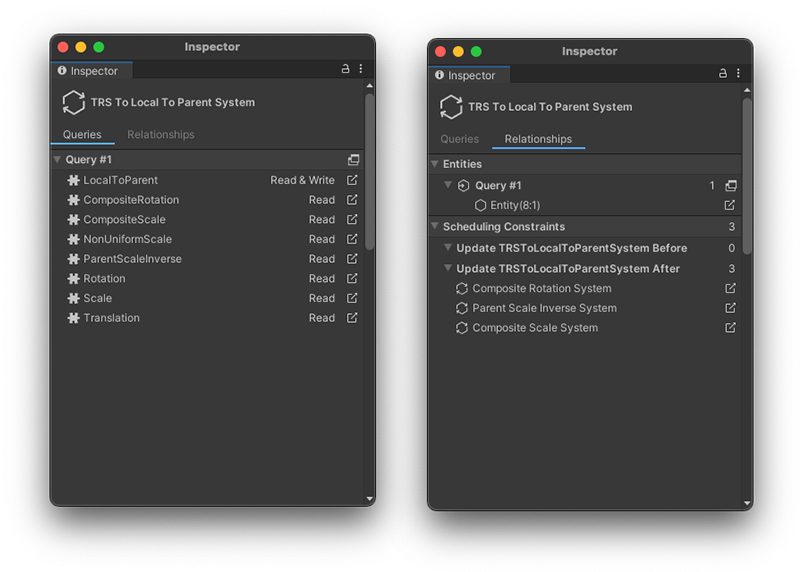

# System Inspector reference

When you select a System in the Editor, the [Inspector](https://docs.unity3d.com/Manual/UsingTheInspector.html) displays its information in two tabs:

* **Queries:** Displays the [queries](ecs_entity_query.md) that the selected System runs, and the list of Components related to that query.
* **Relationships:** Displays the Entities that the System matches, plus any scheduling constraints that the System has. 

 _Systems Inspector - Queries (Left), Relationships (Right)_

## Queries tab

The Queries tab displays the queries that the selected System runs, plus their Components. This view also displays the System’s access rights to the Components (**Read** or **Read & Write**). Click on the icon to the right of a Component name (), to change the selection to that Component. Unity also opens the [Component Inspector](editor-component-inspector.md) where possible.

## Relationships tab

The Relationships tab has two sections:

* **Entities**: Lists the Entities that the System matches, ordered by query. If there are a lot of Entities to display, a **Show All** button is available. When you select **Show All**, Unity displays a list of the matching Entities in a [Query window](editor-query-window.md).
* **Scheduling Constraints:** Lists Systems that are affected by any C# attributes that you’ve added to constrain the System. The selected System updates before the Systems in the **Before** grouping, and after the Systems listed in the **After** grouping

## Additional resources

* [System user manual](ecs_systems.md)
* [Systems window reference](editor-systems-wndow.md)
* [Entity Inspector reference](editor-entity-inspector.md)
* [Component Inspector reference](editor-component-inspector.md)
* [Query window reference](editor-query-window.md)