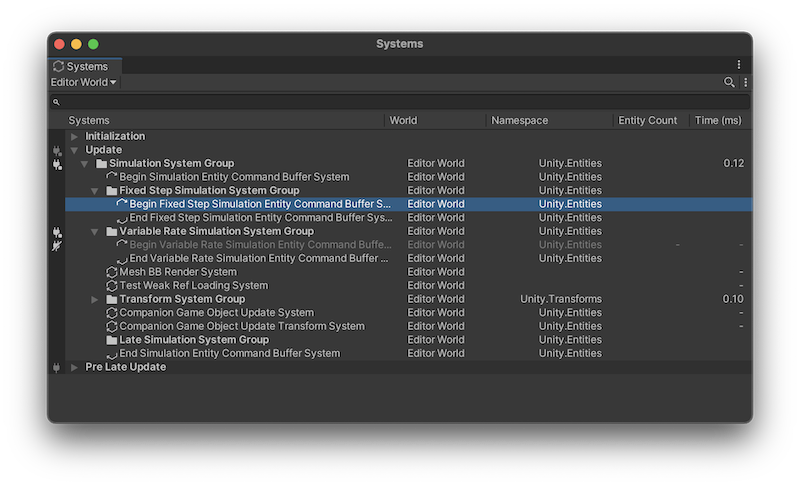

# Systems window reference

The Systems window displays information about the System update order of each [World](world.md) in your project. The window displays a hierarchy of Systems, shown inside their System groups, and updates when the Systems in your application execute and update. 

To open the Systems window go to **Window &gt; DOTS &gt; Systems**. 

 _Systems window with some Systems temporarily disabled_

This view shows:

|**Column**|**Description**|
|---|---|
|Systems|A list of the Systems in your application. When you select a System, Unity displays its information in the [Inspector window](editor-inspectors.md). There are several icons that represent the type of System: |
|| A System group|
|| A System|
|| An Entity Command Buffer System that is set to execute at the beginning of a System Group using the [OrderFirst](xref:Unity.Entities.UpdateInGroupAttribute.OrderFirst) argument.|
|| An Entity Command Buffer System that is set to execute at the end of a System Group using the [OrderLast]((xref:Unity.Entities.UpdateInGroupAttribute.OrderLast)) argument.|
|World|The World where the System operates.  **Note:** The World that calls Update on a System, and the World that this System operates on, might be different. This is because the ECS framework only automatically ticks the Main World (in Play mode), and the Editor World (in Edit mode).   This means that it doesn’t automatically run any Worlds that you’ve created. If you want your Systems to run automatically, you must add them to the Main World, even though they still run against the Entities in your custom World. |
|Namespace|The namespace that the System type belongs to.|
|Entity Count|The number of Entities that match the System’s [queries](ecs_entity_query.md) at the end of the frame.|
|Time (ms)|The amount of time in milliseconds that the System took during this frame. |

To hide a column, select the More menu (⋮) and disable any of the columns you want to hide. 

To help debug your application, you might want to temporarily disable a System. To do this, click the left-most column, which is darker than the other columns, next to the System you want to disable. This change doesn’t persist across Editor sessions. 

To see all the low-level functions that form part of the Unity [player loop](https://docs.unity3d.com/ScriptReference/LowLevel.PlayerLoop.html), including non Entities-related functions, in the More menu (⋮) enable the **Show Full Player Loop** setting. When you enable this setting, any non Entities-related functions are displayed in the window, but are grayed out, and you can't click on them to display further information in the Inspector window.

## Additional resources

* [System user manual](ecs_systems)
* [System Inspector reference](editor-system-inspector.md)
* [World user manual](world.md)
* [Entity Query user manual](ecs_entity_query.md)

