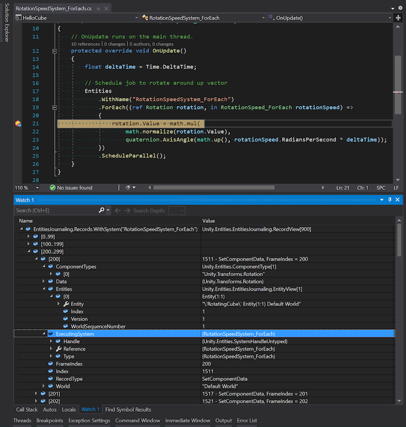

# Entities Journaling

Entities Journaling records every action that you perform in your ECS project to help you debug your project. You can then use your IDE to inspect the data it collects. For example, it records creating or destroying Worlds or Entities, or adding or removing Systems or Components.

Entities Journaling records actions only in:

* Play mode in the Editor
* A Development Build of your project, which you enable in the [Build Settings of your project](ecs_building_projects.md). 

## Enable Entities Journaling

To enable Entities Journaling, you can either:

* Go to **menu: DOTS &gt; Entities Journaling &gt; Enable Entities Journaling.** 
* Enable the option through the DOTS Editor tab in the [Preferences](https://docs.unity3d.com/Manual/Preferences.html) window.

You can also use the preprocessor define `DISABLE_ENTITIES_JOURNALING` to remove all Entities Journaling code from your projects, which can be useful for debugging your project.

## Assign memory to Entities Journaling

To assign total memory to Entities Journaling, use the DOTS Editor tab in the [Preferences](https://docs.unity3d.com/Manual/Preferences.html) window.

The memory is assigned in MB. It's managed as a first in, first out system, which means that Unity overwrites the oldest Journaling records with the newest records when the memory is full. If you need to keep records for longer, increase the memory size to reduce overwrites.

## Inspect records

To inspect the records that Entities Journaling creates:

1. Pause your code with a breakpoint. 
1. Use the APIs available in the [Unity.Entities.EntitiesJournaling](xref:Unity.Entities.EntitiesJournaling) namespace to retrieve and inspect the records.

 _Visual Studio with Entities Journaling records_

Unity assigns an unsigned 64 bit integer index to each record, and categorizes each index as:

* World created or destroyed.
* Entity created or destroyed.
* System added or removed.
* Component added or removed.
* Component data set.

The index indicates in which order the records were added. When you select an index, you can see more information about it:

* The executing system.
* The origin system (in case of entity command buffer).
* Frame index.
* Record index.
* Record type.
* World where the change happened.
* List of entities.
* List of component types.
* Associated data if any, depending on the record type.