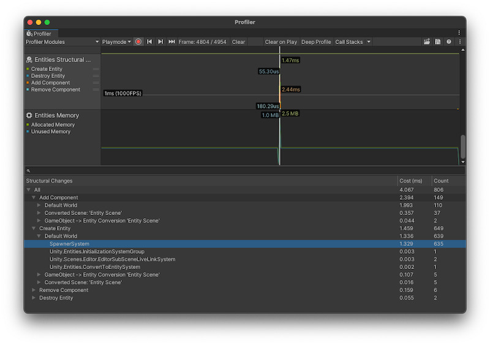

# Entities Profiler modules

You can use the [Unity Profiler]((https://docs.unity3d.com/Manual/Profiler.html)) to profile your application and understand more about the performance of your application. There are two Entities Profiler modules that you can use to track and collect data on the performance of your Entities code:

* [**Entities Structural Changes:**](profiler-module-structural-changes.md) Displays information about when the ECS framework created and destroyed Entities and Components.  
* [**Entities Memory**:](profiler-module-memory.md) Displays how much memory the [Archetypes](ecs_core.md#archetypes) in your project used on a per-frame basis. 

For information on how to use the Profiler, and its other modules, see the Unity User Manual documentation on the [Profiler Window](https://docs.unity3d.com/Manual/Profiler.html). 

To open the Profiler window, go to **Window &gt; Analysis &gt; Profiler**. By default, the Entities Profiler modules appear in the Profiler window. To enable or disable them, use the **Profiler Modules** dropdown. 

>[!IMPORTANT]
>The Profiler doesn’t collect any data for modules that aren’t enabled. If you enable a module after profiling your application, the newly enabled Profiler modules won’t display any data.

You can [profile your application](https://docs.unity3d.com/Manual/profiler-profiling-applications.html) in Play mode, or a development build of your application on a target device. You can also profile the Editor itself, to see how much overhead it has, and to profile [Conversion code](conversion.md), which runs in Edit mode. For more information on how to build your Entities application, see [Building your project](ecs_building_projects.md).

 _Profiler window with the Entities Profiler modules displayed_

## Additional resources

* [Profiler window](https://docs.unity3d.com/Manual/Profiler.html)
* [Profiling your application](https://docs.unity3d.com/Manual/profiler-profiling-applications.html)